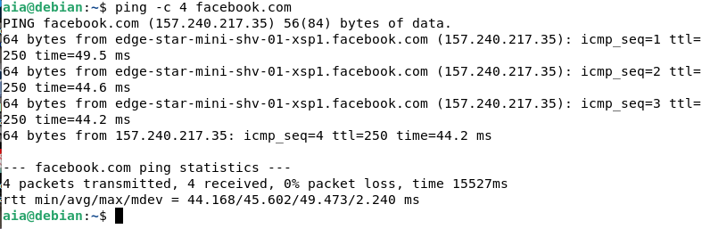

# DNS

1. Buka akun debian pada virtualbox, lalu masukkan su untuk memasuki akun root dan masukkan sandi. 

2. Kemudian tulis nano /etc/network/interface untuk konfigurasi Network Interface yang saya gunakan pada Debian Server. 
  
3. Lalu atur juga file resolv.conf. 

4. Setelah itu kita bias menginstall dns server di Debian, dengan cara “apt install bind9 dnsutils” dan tunggu selasai. 

5. Setelah terinstall kita bisa mengkonfigurasi sdn server dengan menuliskan “cd /etc/bind” lalu masukkan “nano named.conf.local”. 

6. Lalu edit dan tambahkan forward zone dan reverse zone pada file name.conf.local. 

7. Selanjutnya buat file db.aiaaja lalu edit file. 

8. Langkah selanjutnya buat file db.192 lalu edit file. 

9. Langkah selanjutnya buat file name.local.options lalu edit file. 

10. Edit file name.local.options lalu tambahkan IP DNS Server di bagian forwarders dan saya menggunakan IP Gateway dan IP DNS Public 8.8.8.8. 

11. Simpan konfigurasi file tersebut, lalu restart service DNS Server. 

12. Cek status DNS Server dan pastikan status service dalam keadaan active dan running. 

13. Selanjutnya jalankan perintah Nslookup untuk pengetesan ke nama domain pastikan hasilnya nama domain mengarah ke IP Address Server. 
  
14. Setelah tahapan installasi dan konfigurasi DNS Server selesai. Selanjutnya setting masuk pada bagian Network, lalu pada settingan DNS isi dengan IP Address Server. 

15. Selanjutnya lakukan test ping ke nama domain yang sebelumnya kita buat. Jika berhasil maka nama domain akan di terjemahkan ke IP Address Server yaitu 36.86.36.183 dan Lakukan juga test ping ke Internet, sebagai contoh disini saya ping ke facebook.com. 

16. Konfigurasi Web Server dengan install Web Server, untuk aplikasi Web Server kita menggunakan Apache2. 
