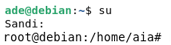
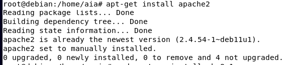
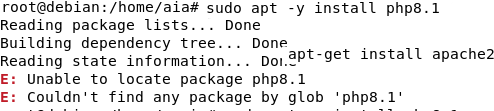
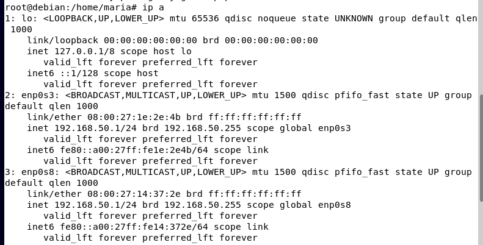
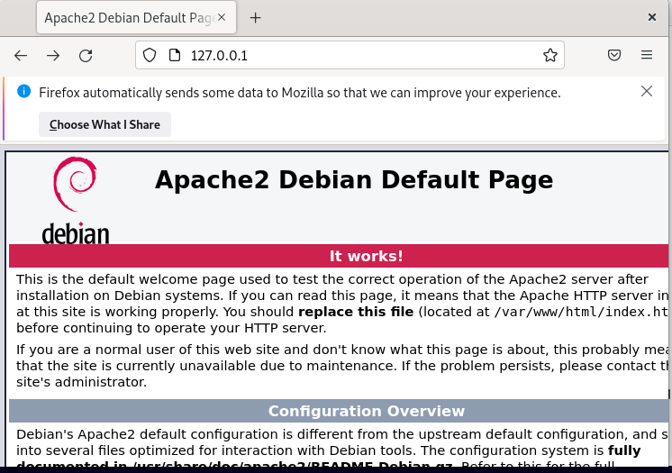
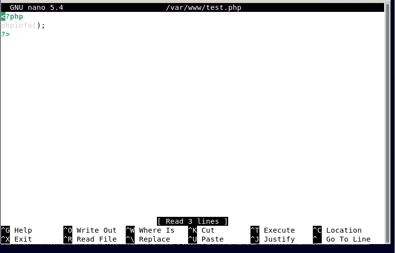
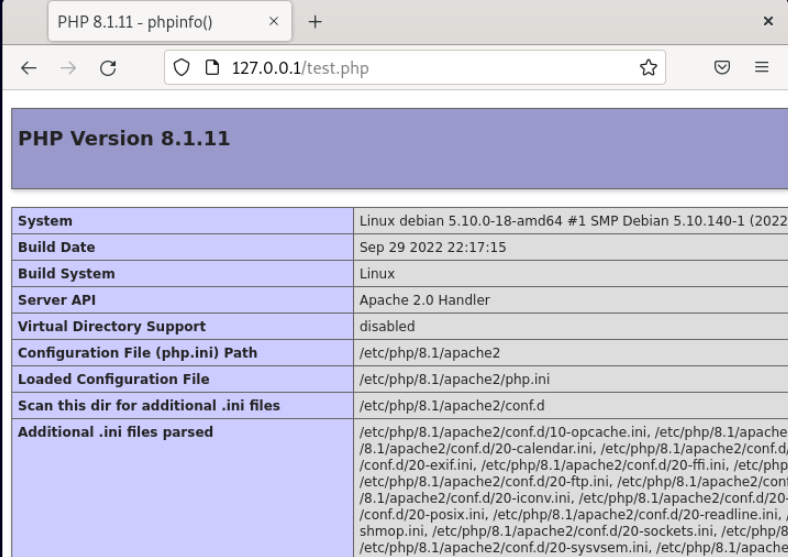

# WEB SERVER

1. Buka debian pada virtualbos lalu cari terminal, setelah terminal muncul masukkan sudo su  dan password akun Debian kita. 
2. Setelah itu install web server dengan memasukkan apt-get install apache2 lalu tunggu sampai selesai. 
3. Lalu install juga bahasa pemrograman php dengan memasukkan apt-get install php8.1 atau sudo apt -y install php8.1. 
4. Lalu konfigurasi dengan memasukkan ip a pada terminal. 

5. Setelah itu kita bias menguji menggunakan script php untuk menampilkan info php pada server kita, Kita akan membuat skrip php pada folder /var/www Jalankan command nano /var/www/html/test/php atau jika gagal nano /var/www/test. php. 
6. Selanjutnya untuk membuka browser dalam linuxnya dan kita ketikan (IP server kalian)/test.php. Maka akan muncul laman tentang info dari php yang kita install pada server.   
